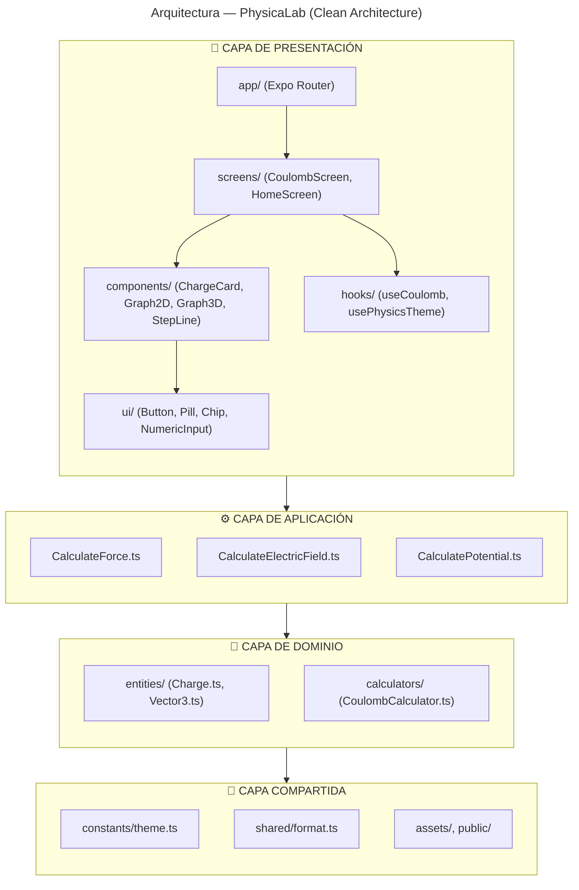
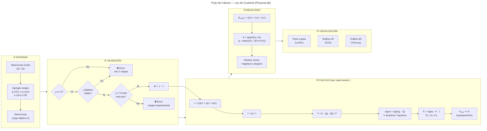

# PhysicaLab ⚛️

Aplicación multiplataforma (iOS / Android / Web) de física interactiva con cálculos paso a paso y visualización 2D/3D. Construida con Expo + TypeScript + Clean Architecture.
---

## Stack

- **Framework:** [Expo](https://expo.dev) (SDK 52) + React Native
- **Lenguaje:** TypeScript
- **Navegación:** Expo Router (file-based routing)
- **Renderizado 3D (web):** Three.js + @react-three/fiber + @react-three/drei
- **Gráficos 2D:** react-native-svg
- **Fórmulas:** MathJax → SVG (react-native-svg)
- **Estado/Arquitectura:** Clean Architecture (domain / application / presentation)

---

## Arquitectura del Software

El proyecto sigue **Clean Architecture** en 3 capas, separando responsabilidades de forma clara:



📐 [`docs/arquitectura.mermaid`](docs/arquitectura.mermaid)

### Flujo de datos

1. **Usuario** ingresa cargas y selecciona modo (2D/3D) en la UI
2. **CoulombScreen** (presentación) llama a `useCoulomb` (hook)
3. **useCoulomb** invoca `CalculateForce` (caso de uso en capa de aplicación)
4. **CalculateForce** valida datos y delega en `CoulombCalculator` (dominio)
5. **CoulombCalculator** aplica la Ley de Coulomb y principio de superposición
6. **Resultado** retorna a la UI: pasos (LaTeX), vectores, gráficas

---

## Diagrama de Flujo — Cálculo de Fuerza Neta

Este diagrama describe el algoritmo implementado en `CoulombCalculator.ts`:



🔀 [`docs/flujo-calculo-fuerza.mermaid`](docs/flujo-calculo-fuerza.mermaid)

---

## Estructura del Proyecto

```
src/
├── app/                      # Expo Router pages
│   ├── _layout.tsx           # Root layout con Stack navigator
│   ├── index.tsx             # Página de inicio (HomeScreen)
│   └── coulomb.tsx           # Ruta del calculador de Coulomb
├── domain/                   # 🧠 Capa de dominio (reglas de negocio)
│   ├── entities/
│   │   ├── Charge.ts         # Modelo de carga puntual (id, q, x, y, z)
│   │   └── Vector3.ts        # Álgebra vectorial 3D (suma, resta, norma, unitario)
│   └── calculators/
│       ├── CoulombCalculator.ts  # ⚡ Implementación de la Ley de Coulomb
│       ├── ElectricFieldCalculator.ts
│       └── PotentialCalculator.ts
├── application/              # ⚙️ Casos de uso
│   ├── CalculateForce.ts     # Orquestador: valida entrada y llama al cálculo
│   ├── CalculateElectricField.ts
│   └── CalculatePotential.ts
├── presentation/             # 📱 Interfaz de usuario
│   ├── components/
│   │   ├── ui/               # Componentes atómicos (Button, Pill, Chip, etc.)
│   │   ├── Graph2D.tsx       # Gráfico de fuerzas 2D (SVG interactivo)
│   │   ├── Graph3D.tsx       # Gráfico 3D isométrico (SVG nativo)
│   │   ├── Graph3D.web.tsx   # Gráfico 3D interactivo (Three.js)
│   │   ├── Graph3DNative.tsx # Fallback nativo para 3D
│   │   ├── MathFormula.tsx   # Renderizador LaTeX → SVG
│   │   ├── StepLine.tsx      # Visualización de paso a paso
│   │   └── ChargeCard.tsx    # Tarjeta de entrada de carga
│   ├── hooks/
│   │   ├── useCoulomb.ts     # Estado y lógica del calculador
│   │   ├── usePhysicsTheme.ts
│   │   └── useThemeMode.tsx
│   └── screens/
│       ├── HomeScreen.tsx    # Pantalla de inicio con lista de módulos
│       └── CoulombScreen.tsx # Pantalla principal del calculador
├── shared/                   # 🔧 Utilidades compartidas
│   ├── constants.ts          # Constantes físicas (k, colores, subíndices)
│   └── format.ts             # Formateo de números, cargas, distancias
├── constants/
│   └── theme.ts              # Tokens de tema (colores, fuentes, espaciado)
├── assets/                   # Imágenes, fuentes, iconos
├── public/                   # Archivos estáticos web (sw.js, manifest.json)
├── docs/                     # Documentación
│   ├── arquitectura.mermaid  # Diagrama de arquitectura
│   └── flujo-calculo-fuerza.mermaid  # Diagrama de flujo Coulomb
└── global.css                # Estilos globales
```

## Requisitos
- [Bun](https://bun.sh) o Node.js ≥ 18
- Expo CLI (`bunx expo`)
- iOS: Xcode + CocoaPods
- Android: Android Studio
- Web: cualquier navegador moderno

## Desarrollo

```bash
bun install          # Instalar dependencias
bun run web          # Iniciar en navegador
bun run android      # Iniciar en Android
bun run ios          # Iniciar en iOS
```

## Build producción

```bash
npx expo export --platform web   # Web (static SPA)
npx expo build:android           # Android APK/AAB (EAS)
npx expo build:ios               # iOS IPA (EAS)
```

## Módulos

### Ley de Coulomb
- Cálculo de fuerza electrostática entre cargas puntuales
- Modos 2D (plano xy) y 3D (xyz)
- Paso a paso con fórmulas renderizadas en LaTeX
- Gráfica 2D vectorial (SVG) interactiva con zoom/arrastre
- Gráfica 3D interactiva (web, Three.js con OrbitControls)

## Theme

- Modo claro/oscuro con toggle manual (🌙/☀️)
- Paleta limpia: azul (#2563eb) como accent
- Rojo para cargas positivas, azul para negativas


